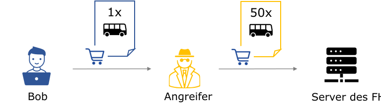

  
Bob ist Inhaber eines kleinen Reiseunternehmens und möchte einen seiner Busse durch ein neueres Modell ersetzen. Er sendet dazu eine Bestellung an einen Fahrzeughersteller (FH). Um die Korrektheit und Glaubwürdigkeit der Bestellung gegenüber dem Fahrzeughersteller nachzuweisen, legt Bob dem Bestellformular einen Message Authentication Code (MAC) bei. Hierfür haben beide zuvor einen geheimen Schlüssel ausgetauscht. 
Einer seiner Konkurrenten hat sich Zugang zu seinem Netzwerk verschafft und die Nachricht sowie den MAC abgefangen. Er möchte Bob in finanzielle Schwierigkeiten bringen, indem er die Anzahl an bestellter Busse stark erhöht. Hierfür führt er einen Length Extension Angriff durch, wobei der Angreifer in der Lage ist, die ursprüngliche Bestellung zu erweitern und einen gültigen MAC dieser zu berechnen, ohne den geheimen Schlüssel k zu kennen. Anschließend leitet er die erweiterte Bestellung (inkl. MAC) an den Fahrzeughersteller. Er hofft, dass Bob die hohe Rechnung nicht begleichen kann und daher sein Geschäft aufgeben muss.
  
Im Folgenden übernehmen Sie die Rolle des Angreifers und führen den Length Extension Angriff auf die ursprüngliche Nachricht durch (Schritt 2-9).
  
Abschließend werden Sie die vom Server empfangene Nachricht auf Authentizität und Integrität überprüfen (Schritt 10).
