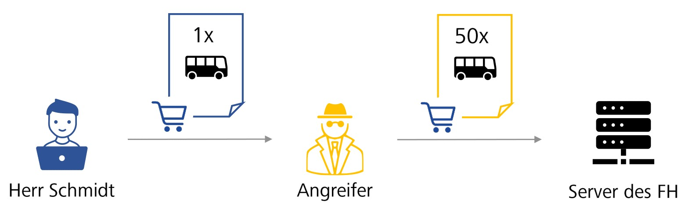

 
Herr Schmidt ist Inhaber eines kleinen Reiseunternehmens möchte einen seiner Busse durch ein neueres Modell ersetzen. Er sendet dazu eine verstehene Bestellung an einen Fahrzeughersteller (FH). Einer seiner Konkurrenten hat sich Zugang zu seinem Netzwerk verschafft und agiert als Man-in-the-Middle Angreifer. Er fängt die Nachricht ab und führt einen eines Length Extension Angriff durch, wobei er die Anzahl der Busse in Herr Schmitts Bestellung stark erhöht. Anschließend leitet er die modifizierte Bestellung an den Fahrzeughersteller weiter. Er hofft, dass Herr Schmitt die hohe Rechnung nicht begleichen kann und daher sein Geschäft aufgeben muss. 
  
Im Folgenden übernehmen Sie die Rolle des Angreifers und führen den Length Extension Angriff auf die ursprüngliche Nachricht durch (Schritt 1-8).
  
Abschließend werden Sie die vom Server empfangene Nachricht auf Authentizität und Integriät überprüfen (Schritt 9).
